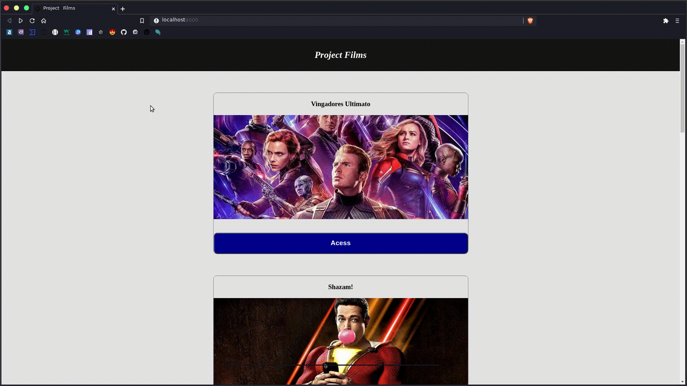

# :earth_americas: consuming movies API :earth_americas:

---

---

## :pushpin: requirements: :pushpin:

ReactJs: https://pt-br.reactjs.org/

NodeJs: https://nodejs.org/en/

---
#### :arrow_forward:   Get Started: 
  - Clone this repository and in root folder use _npm install/yarn install_. 
  - After installing all dependencies, run _npm start/yarn start_.

<h4 align="center">:arrow_down_small:   Params on components: </h4>\

  

---  

<h4 align="center">:id:   Inserting parameters:</h4> 

